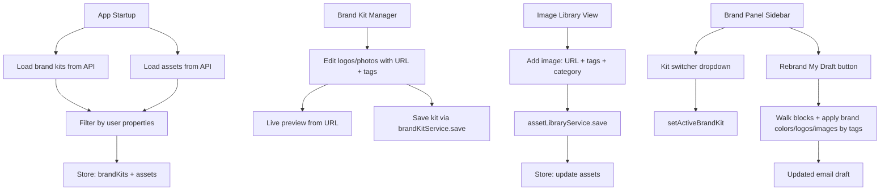
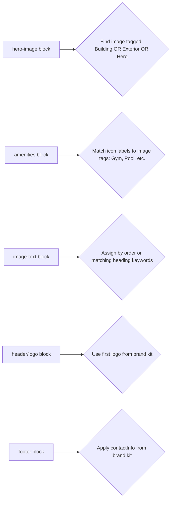

# Plan: Brand Kit Enhancements, Rebrand Draft, & Image Library

## Feature Summary

Six interconnected features requested:

1. **Property selector in Brand Kit** — Only show properties the user has API access to
2. **Brand Panel sidebar switcher** — Toggle between multiple brand kits in the left sidebar
3. **Brand Kit image management** — Logo/photo URL fields with live preview & tag system
4. **Rebrand My Draft** — Apply brand kit assets to current email project
5. **Image Library tab** — Full-page view to manage all property images, including one-offs
6. **API persistence for images** — All image data saved via `assetLibraryService`

---

## Existing Infrastructure

| Component | Status | Notes |
|-----------|--------|-------|
| `Asset` type | Exists | Has `id`, `name`, `category`, `thumbnailUrl`, `sourceUrl`, `altText`, `propertyId`, `tags[]` |
| `BrandKit` type | Exists | Has `logos: Asset[]`, `images: Asset[]`, `floorplans: Asset[]` — but the editor UI has no fields for these |
| `assetLibraryService` | Exists | Full CRUD API at `/.netlify/functions/email-assets` |
| `AssetPanel` | Exists | Left sidebar panel, reads from `store.assets`, search + category filter |
| `AssetLibraryView` | Exists | Full-page view but only reads — no add/edit/delete UI |
| `BrandPanel` | Exists | Shows active kit colors/fonts/buttons — no kit switcher |
| `BrandKitManager` | Exists | Full editor for colors/fonts/buttons/snippets — no image fields |

---

## Implementation Plan

### 1. Brand Kit Property Selector

**File: `src/components/brand/BrandKitManager.tsx`**

Currently the Property ID is a free-text input. Change it to a dropdown that only shows properties the user has access to.

- Read `getUserProperties()` from `authContext.ts` to get the list of property IDs
- The API already returns properties as string IDs; we need human-readable names
- Add a `userProperties` state loaded from `getAuthUser().properties`
- If admin/wildcard, show all properties; otherwise filter the dropdown
- Property names may need to come from brand kits themselves or a simple mapping

### 2. Brand Panel Sidebar Switcher

**File: `src/components/brand/BrandPanel.tsx`**

Currently shows only `activeBrandKit`. Enhance to:

- Show a dropdown at the top listing all `brandKits` from the store
- When user selects a different kit, call `setActiveBrandKit(kit)`
- Show the active kit name with a colored indicator
- Keep the existing color/font/button/contact/snippet display below

### 3. Brand Kit Image Management

**File: `src/components/brand/BrandKitManager.tsx`**

Add three new sections to the `BrandKitEditor`:

#### Logos Section
- Each logo entry: URL input + preview thumbnail + alt text + tags
- Live preview: show the image from the URL in a small thumbnail
- Tags: comma-separated input that splits into `tags[]` array
- Add/remove logos

#### Property Photos Section  
- Same pattern as logos but with `category: 'photo'`
- Suggested tags: Gym, Kitchen, Bike Storage, Building, Events, Pool, Lobby, Bedroom, Bathroom, Exterior
- Preview window shows the image from the entered URL
- Tags are stored on each `Asset` object

#### Floorplans Section
- Same pattern with `category: 'floorplan'`
- Tags like: Studio, 1BR, 2BR, 3BR, Penthouse

Each image entry stored as an `Asset` in the brand kit's `logos[]`, `images[]`, or `floorplans[]` array.

### 4. Rebrand My Draft

**File: `src/components/brand/BrandPanel.tsx`** (add button)
**File: `src/store/useEditorStore.ts`** (add `rebrandDraft` action)

Add a "Rebrand My Draft" button in the Brand Panel sidebar. When clicked:

1. Read `activeBrandKit` from the store
2. Walk through all `blocks` in the current project
3. For each block, apply brand kit values:
   - **Colors**: Replace block background colors and text colors with brand kit primary/secondary colors
   - **Logos**: Find `header` and `logo` blocks, set `logoUrl`/`imageUrl` to the first brand kit logo
   - **Images**: Match block types to tagged images:
     - `hero-image` block -> look for image tagged "Building" or "Exterior"
     - `amenities` block icons -> match icon labels to image tags
     - `image-text` blocks -> assign images by tag order
   - **Buttons**: Apply first brand kit button style to all button blocks
   - **Footer**: Apply brand kit contact info to footer blocks
   - **Global styles**: Update `fontFamily` from brand kit fonts
4. Push history before applying changes so user can undo

### 5. Image Library Tab

**File: `src/components/assets/AssetLibraryView.tsx`** — Major enhancement

Transform from read-only to full CRUD:

- **Add Image button**: Opens a form with:
  - Name field
  - Image URL field (paste Entrata media library URL)
  - Category dropdown: Logo, Photo, Floorplan, Icon, Banner, Other
  - Tags input: comma-separated with suggested tags dropdown
  - Alt text field
  - Live preview of the entered URL
- **Edit**: Click edit icon on any image card to modify
- **Delete**: Click delete with confirmation
- **Save**: All operations go through `assetLibraryService.save()` / `.delete()`
- **Property scoping**: Only show images for user's accessible properties

### 6. API Wiring & App Startup

**File: `src/App.tsx`**

- Load assets on startup via `assetLibraryService.getAll()` 
- Filter by user's property access
- Store in `useEditorStore.assets`

---

## Files to Create or Modify

| File | Action | Changes |
|------|--------|---------|
| `src/components/brand/BrandPanel.tsx` | Modify | Add kit switcher dropdown + Rebrand My Draft button |
| `src/components/brand/BrandKitManager.tsx` | Modify | Add property dropdown, logo/photo/floorplan sections with preview + tags |
| `src/components/assets/AssetLibraryView.tsx` | Modify | Add CRUD: add/edit/delete images with URL preview + tags |
| `src/store/useEditorStore.ts` | Modify | Add `rebrandDraft()` action, add `addAsset/updateAsset/deleteAsset` actions |
| `src/App.tsx` | Modify | Load assets from API on startup |

## Data Flow Diagram

## Tag-Based Auto-Assignment Logic

When rebranding a draft, images from the brand kit are matched to blocks by tags:

## Suggested Tag Presets

For the tag input, offer these as clickable suggestions:

**Photos**: Building, Exterior, Interior, Lobby, Pool, Gym, Kitchen, Bedroom, Bathroom, Living Room, Bike Storage, Events, Community, Study Lounge, Rooftop, Parking, Laundry, Pet Area

**Logos**: Primary, Secondary, White, Dark, Icon, Full

**Floorplans**: Studio, 1BR, 2BR, 3BR, 4BR, Penthouse, Townhome
