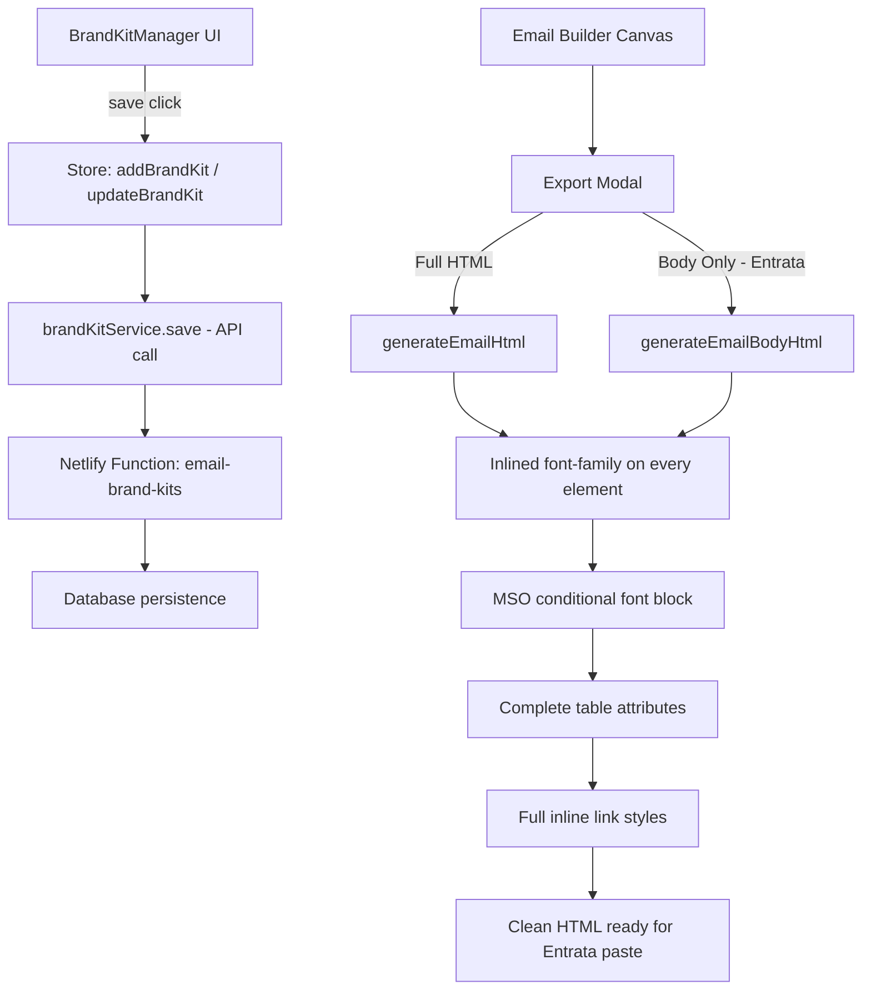

# Plan: Fix Brand Kit Persistence & Entrata HTML Export Quality

## Problem Summary

Two issues reported:

1. **Brand Kit does not save** — Creating/editing a brand kit in the UI updates only in-memory Zustand state. The `BrandKitManager` component never calls `brandKitService.save()` or `brandKitService.delete()`, so changes are lost on page reload.

2. **Entrata export has broken fonts, sizing, and links** — The HTML generator produces output that relies on `<body>` and `<style>` block inheritance for font-family, which Entrata's Message Center strips when pasting. The working reference email provided by the user inlines `font-family: Arial, Helvetica, sans-serif` on **every** text-bearing element (`<td>`, `<div>`, `<a>`, `<p>`, `<h1>`–`<h3>`).

---

## Root Cause Analysis

### Brand Kit Not Saving

| File | Issue |
|------|-------|
| `src/components/brand/BrandKitManager.tsx` | `handleSave()` calls `addBrandKit(kit)` / `updateBrandKit(kit)` on the Zustand store but never calls `brandKitService.save(kit)` |
| `src/components/brand/BrandKitManager.tsx` | `handleDelete()` calls `deleteBrandKit(id)` on the store but never calls `brandKitService.delete(id)` |
| `src/store/useEditorStore.ts` | Store actions are purely in-memory; no side-effect to API |

### Entrata HTML Export Issues

Comparing our `htmlGenerator.ts` output with the user's working Entrata email:

| Issue | Our Generator | Working Entrata Email |
|-------|--------------|----------------------|
| **Font-family** | Only on `<body>` and wrapper `<table>` | On every `<td>`, `<div>`, `<a>`, `<p>` element |
| **MSO font block** | Missing | Has `<!--[if mso]><style>` block forcing Arial on `body, table, td, p, a, span` |
| **Link styles** | Minimal inline styles | Full inline: `font-family`, `font-size`, `line-height`, `font-weight`, `color`, `text-decoration`, `padding`, `display` |
| **Table attributes** | Sometimes missing `role="presentation"` | Every table has `border="0" cellpadding="0" cellspacing="0" role="presentation"` |
| **CSS classes** | Uses `email-container`, `stack-column`, etc. | Zero CSS classes — 100% inline styles |
| **Width attributes** | HTML `width` attribute sometimes missing | Both HTML `width="700"` attribute AND `style="width:100%"` |

---

## Implementation Plan

### 1. Fix Brand Kit Persistence

**File: `src/components/brand/BrandKitManager.tsx`**

- In `handleSave()`: after the store update, call `await brandKitService.save(editingKit)` and handle errors with a try/catch + user feedback
- In `handleDelete()`: after the store delete, call `await brandKitService.delete(id)` and handle errors
- Import `brandKitService` from `@/services`
- Add loading/error state for save/delete operations

### 2. Entrata-Compatible HTML Export

**File: `src/engine/htmlGenerator.ts`**

#### 2a. Add font-family helper
Create a helper function that returns `font-family: Arial, Helvetica, sans-serif;` (using globalStyles) to be applied to every text-bearing element. This replaces relying on body-level inheritance.

#### 2b. Update every block renderer
For each render function, add explicit `font-family` to every `<td>`, `<div>`, `<p>`, `<h1>`–`<h3>`, and `<a>` element:
- `renderHeader` — font on the content td
- `renderText` — font on the `<p>` tag
- `renderButton` — font on the `<a>` tag
- `renderImageText` — font on headings, paragraphs, links
- `renderTwoColumn` — font on content cells
- `renderAmenities` — font on heading, labels, descriptions
- `renderFloorplanSpotlight` — font on all text elements
- `renderPromoBanner` — font on heading, subheading, button
- `renderCalloutBox` — font on heading and body
- `renderTestimonial` — font on quote, author, title
- `renderFooter` — font on all text/link elements
- `renderSocialLinks` — font on link elements
- `renderBrandedHeader` — font on heading, subheading
- `renderVirtualTour` — font on heading, description, button

#### 2c. Add MSO font-family conditional style block
Add to the `<head>` section:
```html
<!--[if mso]>
<style type="text/css">
body, table, td, p, a, span {font-family: Arial, sans-serif !important;}
</style>
<![endif]-->
```

#### 2d. Ensure all tables have complete attributes
Audit every `<table>` tag and ensure it has: `border="0" cellpadding="0" cellspacing="0" role="presentation"`.

#### 2e. Ensure all links have full inline styles
Every `<a>` tag should have explicit: `font-family`, `font-size`, `line-height`, `font-weight`, `color`, `text-decoration`, `display`.

#### 2f. Add `width` HTML attributes to wrapper tables
Ensure the outer content table has `width="600"` (or contentWidth) as an HTML attribute alongside the inline style.

### 3. Entrata "Body Only" Export Enhancement

**File: `src/components/export/ExportModal.tsx`**

The "Body Only" export already exists. Enhance it to:
- Include the MSO font conditional comment at the top of the body output
- Strip any CSS class references from the output
- Add a brief instruction note: "Paste this directly into Entrata Message Center source editor"

### 4. Validation

- Verify the generated HTML structure matches the patterns in the user's working example
- Ensure no CSS class dependencies remain in exported HTML
- Verify all `<a href>` links preserve their URLs and have complete inline styles

---

## Files to Modify

| File | Changes |
|------|---------|
| `src/components/brand/BrandKitManager.tsx` | Wire save/delete to `brandKitService` API |
| `src/engine/htmlGenerator.ts` | Inline font-family on all elements, MSO block, table attributes, link styles |
| `src/components/export/ExportModal.tsx` | Enhance body-only export for Entrata compatibility |

## Architecture Diagram


