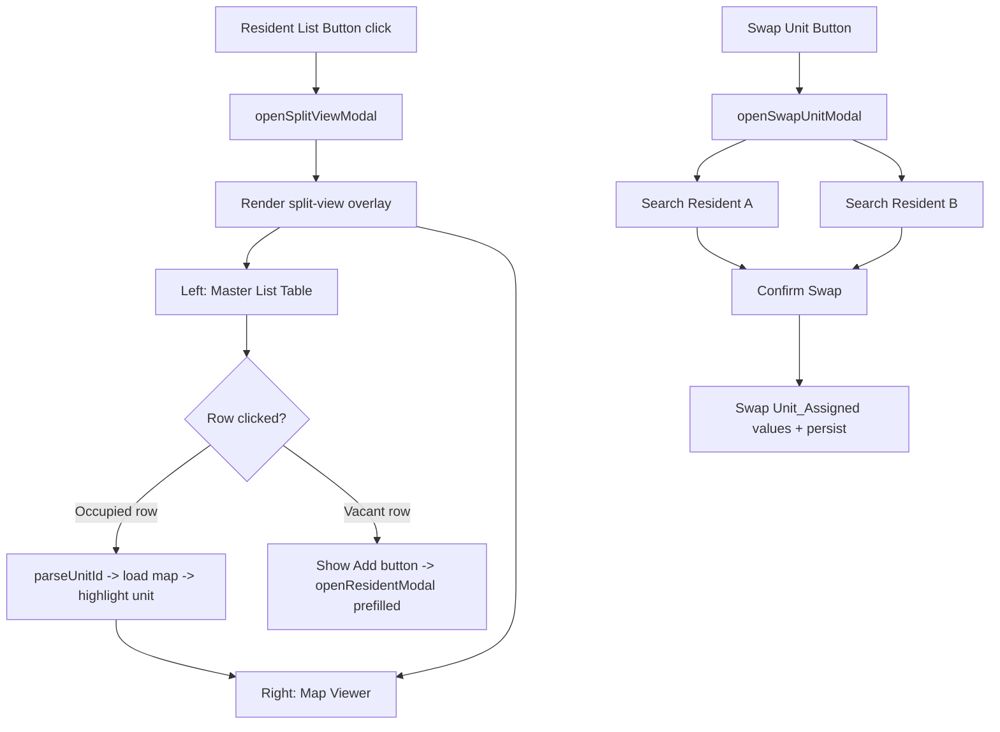
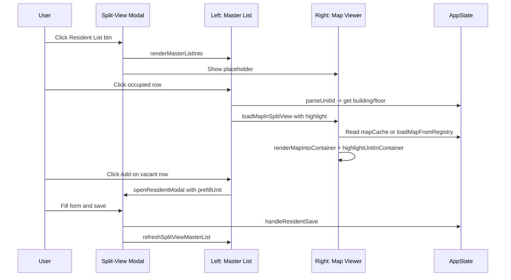

# Split-View Resident Master List Modal — Implementation Plan

## Overview

Replace the current slide-up drawer (`#master-list-drawer`) with a full-screen split-view modal. Left half shows the resident master list table with search/filters. Right half shows an interactive map viewer with building/floor selectors. Add a "Swap Unit" feature accessible from the main map actions bar.

---

## Architecture Summary



---

## File Changes Summary

| File | Action | What |
|------|--------|------|
| `index.html` | **Modify** | Remove `#master-list-drawer`, add `#split-view-overlay` and `#swap-unit-overlay` HTML |
| `styles.css` | **Modify** | Add split-view modal CSS, swap modal CSS, remove drawer CSS |
| `map.js` | **Modify** | Extract `renderMapIntoContainer` from `renderMap`, add `highlightUnitInContainer` and `bindUnitClicksInContainer` |
| `ui.js` | **Modify** | Add `openSplitViewModal`, `closeSplitViewModal`, `renderMasterListInto`, `populateModalMapSelectors`, `openSwapUnitModal` |
| `app.js` | **Modify** | Rewire `#toggle-master-list-btn` to `openSplitViewModal`, add `#swap-unit-btn` wiring, add swap persistence logic |

---

## 1. HTML Structure Changes (`index.html`)

### 1a. Remove: `#master-list-drawer` (lines 202-213)

Delete the entire drawer block.

### 1b. Add: Swap Unit button to `#map-actions` (line 196)

```html
<button id="swap-unit-btn" class="btn btn-secondary">Swap Units</button>
```

Insert after the existing `#export-map-btn` button.

### 1c. Add: Split-View Overlay (before `#modal-overlay`)

```html
<!-- ====== SPLIT-VIEW MASTER LIST MODAL ====== -->
<div id="split-view-overlay" class="split-view-overlay" style="display:none">
  <div class="split-view-container">

    <!-- Left Panel: Master List -->
    <div class="split-view-left">
      <div class="split-view-left-header">
        <h3 class="split-view-title">Resident Master List</h3>
        <div class="split-view-left-actions">
          <button id="sv-export-btn" class="btn btn-sm btn-outline">Export</button>
          <button id="sv-close-btn" class="btn btn-sm btn-secondary">Close</button>
        </div>
      </div>
      <div id="sv-master-list" class="split-view-left-body">
        <!-- renderMasterListInto targets this container -->
      </div>
    </div>

    <!-- Right Panel: Map Viewer -->
    <div class="split-view-right">
      <div class="split-view-right-header">
        <div class="split-view-map-selectors">
          <select id="sv-building-selector" class="select-input"></select>
          <select id="sv-floor-selector" class="select-input"></select>
        </div>
        <span id="sv-map-label" class="split-view-map-label"></span>
      </div>
      <div id="sv-map-container" class="split-view-map-container">
        <p class="placeholder-text">Click a resident row to view their unit on the map</p>
      </div>
    </div>

  </div>
</div>
```

### 1d. Add: Swap Unit Modal Overlay (after split-view overlay)

```html
<!-- ====== SWAP UNIT MODAL ====== -->
<div id="swap-unit-overlay" class="modal-overlay" style="display:none">
  <div class="modal-content swap-unit-modal">
    <div class="modal-header">
      <h3>Swap Units</h3>
      <button id="swap-close-btn" class="modal-close-btn">&times;</button>
    </div>
    <div class="modal-body" id="swap-unit-body">
      <p class="swap-instructions">Select two residents to swap their unit assignments.</p>
      <div class="swap-slot" id="swap-slot-a">
        <label>Resident A</label>
        <input type="text" id="swap-search-a" class="text-input" placeholder="Search by name or unit..." />
        <div id="swap-results-a" class="swap-search-results"></div>
        <div id="swap-selected-a" class="swap-selected-card" style="display:none"></div>
      </div>
      <div class="swap-arrow">&#8596;</div>
      <div class="swap-slot" id="swap-slot-b">
        <label>Resident B</label>
        <input type="text" id="swap-search-b" class="text-input" placeholder="Search by name or unit..." />
        <div id="swap-results-b" class="swap-search-results"></div>
        <div id="swap-selected-b" class="swap-selected-card" style="display:none"></div>
      </div>
    </div>
    <div class="modal-footer">
      <button id="swap-cancel-btn" class="btn btn-secondary">Cancel</button>
      <button id="swap-confirm-btn" class="btn btn-primary" disabled>Swap Units</button>
    </div>
  </div>
</div>
```

---

## 2. CSS Classes and Layout (`styles.css`)

### 2a. Remove drawer styles

Delete all `.master-list-drawer`, `.master-list-drawer-header`, `.master-list-drawer-body` rules.

### 2b. Split-View Overlay Layout

```
.split-view-overlay        — fixed fullscreen, z-index: 1000, bg: rgba(0,0,0,0.6), display:flex, align/justify center
.split-view-container      — width: 95vw, height: 90vh, display: flex, bg: white, border-radius: 12px, overflow: hidden, box-shadow
.split-view-left           — flex: 0 0 50%, display: flex, flex-direction: column, border-right: 1px solid #e5e7eb
.split-view-left-header    — flex-shrink: 0, padding: 12px 16px, display: flex, justify-content: space-between, align-items: center, border-bottom
.split-view-left-body      — flex: 1, overflow-y: auto, padding: 0
.split-view-right          — flex: 1, display: flex, flex-direction: column
.split-view-right-header   — flex-shrink: 0, padding: 12px 16px, display: flex, gap: 8px, align-items: center, border-bottom
.split-view-map-container  — flex: 1, overflow: auto, display: flex, align-items: center, justify-content: center, background: #f9fafb
.split-view-map-label      — font-size: 13px, color: #6b7280, margin-left: auto
```

### 2c. Swap Unit Modal Styles

```
.swap-unit-modal           — max-width: 540px
.swap-slot                 — margin-bottom: 16px
.swap-arrow                — text-align: center, font-size: 24px, color: #6b7280, margin: 8px 0
.swap-search-results       — max-height: 150px, overflow-y: auto, border: 1px solid #e5e7eb, border-radius: 6px
.swap-search-results .swap-result-item — padding: 8px 12px, cursor: pointer, hover: bg #f3f4f6
.swap-selected-card        — padding: 10px 14px, bg: #eff6ff, border: 1px solid #bfdbfe, border-radius: 6px, display: flex, justify-content: space-between
```

---

## 3. Map Rendering Refactor (`map.js`)

### 3a. New function: `renderMapIntoContainer(container, svgElement, residents, options)`

Extract the core rendering logic from [`renderMap()`](placement-planner/map.js:121) into a new function that accepts an arbitrary DOM container instead of hardcoding `document.getElementById('map-container')`.

**Signature:**
```js
function renderMapIntoContainer(container, svgElement, residents, options) {
  // options: { showNames, scholarshipOnly, inventory, onUnitClick }
  // Returns: { unmatchedUnits, svgUnitIds }
}
```

**Implementation approach:**
1. Copy the body of `renderMap()` lines 122-304
2. Replace `document.getElementById('map-container')` with the `container` parameter
3. Remove the `emptyState` handling (modal has its own placeholder)
4. If `options.onUnitClick` is provided, bind click delegation on the SVG using `getClickableUnitIdFromSvgEvent`
5. Return the same `{ unmatchedUnits, svgUnitIds }` result

**Then refactor `renderMap()` to delegate:**
```js
function renderMap(svgElement, residents, options) {
  const container = document.getElementById('map-container');
  const emptyState = document.getElementById('emptyState');
  if (emptyState) emptyState.style.display = 'none';
  return renderMapIntoContainer(container, svgElement, residents, options);
}
```

### 3b. New function: `highlightUnitInContainer(container, unitId)`

Same as [`highlightUnit()`](placement-planner/map.js:448) but accepts a container parameter instead of using `#map-container`.

```js
function highlightUnitInContainer(container, unitId) {
  var svg = container.querySelector('svg');
  if (!svg) return;
  svg.querySelectorAll('.unit-highlight').forEach(function(el) {
    el.classList.remove('unit-highlight');
  });
  var normalized = unitId.toUpperCase();
  svg.querySelectorAll('[data-unit]').forEach(function(u) {
    if (u.getAttribute('data-unit').toUpperCase() === normalized) {
      u.classList.add('unit-highlight');
      u.scrollIntoView({ behavior: 'smooth', block: 'center', inline: 'center' });
    }
  });
}
```

### 3c. New function: `applyLabelsPostRenderInContainer(container)`

Same as [`applyLabelsPostRender()`](placement-planner/map.js:373) but accepts a container parameter.

---

## 4. UI Functions (`ui.js`)

### 4a. New function: `openSplitViewModal()`

Opens the `#split-view-overlay`, populates the building/floor selectors in the right panel, and renders the master list into `#sv-master-list`.

```js
function openSplitViewModal() {
  var overlay = document.getElementById('split-view-overlay');
  overlay.style.display = 'flex';
  
  // Populate map selectors
  populateModalMapSelectors();
  
  // Render master list into the modal container
  renderMasterListInto(
    document.getElementById('sv-master-list'),
    AppState.residents || new Map(),
    AppState.inventory || [],
    AppState.filters,
    {
      onEdit: handleResidentEdit,
      onDelete: handleResidentDelete,
      onRowClick: handleSplitViewRowClick,
      onAddResident: handleSplitViewAddResident,
    }
  );
}
```

### 4b. New function: `closeSplitViewModal()`

```js
function closeSplitViewModal() {
  var overlay = document.getElementById('split-view-overlay');
  overlay.style.display = 'none';
  // Clear map container
  var mapContainer = document.getElementById('sv-map-container');
  mapContainer.innerHTML = '<p class="placeholder-text">Click a resident row to view their unit on the map</p>';
}
```

### 4c. New function: `renderMasterListInto(container, residents, inventory, filters, callbacks)`

A refactored version of [`renderMasterList()`](placement-planner/ui.js:540) that renders into any container. Key differences from the original:

1. Accepts `container` as first param instead of hardcoding `document.getElementById('resident-master-list')`
2. All internal `getElementById` calls for search/filter/tbody use `container.querySelector()` instead
3. The `callbacks` object gains a new `onAddResident` callback
4. For vacant rows, render an **Add** button in the Actions column:
   ```js
   if (!isOccupied) {
     var addBtn = document.createElement('button');
     addBtn.className = 'action-btn add';
     addBtn.textContent = 'Add';
     addBtn.addEventListener('click', function(e) {
       e.stopPropagation();
       if (callbacks.onAddResident) callbacks.onAddResident(unit, unitType);
     });
     tdActions.appendChild(addBtn);
   }
   ```
5. For vacant rows, clicking the row itself also triggers `onAddResident`

After this refactor, update the original [`renderMasterList()`](placement-planner/ui.js:540) to delegate:
```js
function renderMasterList(residents, inventory, filters, callbacks) {
  var container = document.getElementById('resident-master-list');
  if (!container) return;
  renderMasterListInto(container, residents, inventory, filters, callbacks);
}
```

### 4d. New function: `populateModalMapSelectors()`

Populates `#sv-building-selector` and `#sv-floor-selector` using [`getRegisteredBuildings()`](placement-planner/config.js:237), [`getFloorsForBuilding()`](placement-planner/config.js:245), [`getBuildingLabel()`](placement-planner/config.js:261), [`getFloorLabel()`](placement-planner/config.js:265).

```js
function populateModalMapSelectors() {
  var bSelect = document.getElementById('sv-building-selector');
  var fSelect = document.getElementById('sv-floor-selector');
  bSelect.innerHTML = '';
  
  var buildings = getRegisteredBuildings();
  for (var i = 0; i < buildings.length; i++) {
    var opt = document.createElement('option');
    opt.value = buildings[i];
    opt.textContent = getBuildingLabel(buildings[i]);
    bSelect.appendChild(opt);
  }
  
  // Set initial building to match main selector
  if (AppState.selectedBuilding) {
    bSelect.value = AppState.selectedBuilding;
  }
  
  // Populate floors for the selected building
  updateModalFloorSelector();
}

function updateModalFloorSelector() {
  var bSelect = document.getElementById('sv-building-selector');
  var fSelect = document.getElementById('sv-floor-selector');
  var buildingKey = bSelect.value;
  fSelect.innerHTML = '';
  
  var floors = getFloorsForBuilding(buildingKey);
  for (var i = 0; i < floors.length; i++) {
    var opt = document.createElement('option');
    opt.value = floors[i];
    opt.textContent = getFloorLabel(floors[i]);
    fSelect.appendChild(opt);
  }
  
  if (AppState.selectedFloor != null) {
    fSelect.value = AppState.selectedFloor;
  }
}
```

### 4e. New function: `loadMapInSplitView(buildingKey, floor, highlightUnitId)`

Loads and renders the correct map SVG into `#sv-map-container`.

```js
async function loadMapInSplitView(buildingKey, floor, highlightUnitId) {
  var container = document.getElementById('sv-map-container');
  var label = document.getElementById('sv-map-label');
  container.innerHTML = '<p class="placeholder-text">Loading map...</p>';
  
  var cacheKey = buildingKey + ':' + floor;
  var mapData = AppState.mapCache.get(cacheKey);
  
  if (!mapData) {
    mapData = await loadMapFromRegistry(buildingKey, floor);
    if (mapData) AppState.mapCache.set(cacheKey, mapData);
  }
  
  if (!mapData) {
    container.innerHTML = '<p class="placeholder-text">Map not available</p>';
    return;
  }
  
  label.textContent = getBuildingLabel(buildingKey) + ' — ' + getFloorLabel(floor);
  
  var residents = AppState.residents || new Map();
  renderMapIntoContainer(container, mapData.svgElement, residents, {
    showNames: AppState.showNames,
    scholarshipOnly: AppState.scholarshipOnly,
    inventory: AppState.inventory,
    onUnitClick: function(unitId) {
      // Optional: show unit detail in a tooltip or just highlight
      highlightUnitInContainer(container, unitId);
    }
  });
  
  if (highlightUnitId) {
    highlightUnitInContainer(container, highlightUnitId);
  }
}
```

### 4f. New function: `openSwapUnitModal()`

Opens the swap-unit overlay with two resident search fields.

```js
function openSwapUnitModal() {
  var overlay = document.getElementById('swap-unit-overlay');
  overlay.style.display = 'flex';
  
  // Reset state
  _swapState = { a: null, b: null };
  document.getElementById('swap-search-a').value = '';
  document.getElementById('swap-search-b').value = '';
  document.getElementById('swap-results-a').innerHTML = '';
  document.getElementById('swap-results-b').innerHTML = '';
  document.getElementById('swap-selected-a').style.display = 'none';
  document.getElementById('swap-selected-b').style.display = 'none';
  document.getElementById('swap-confirm-btn').disabled = true;
}
```

### 4g. New function: `renderSwapSearchResults(query, resultsContainer, slot)`

Searches `AppState.residents` by name or unit, renders clickable result items.

```js
function renderSwapSearchResults(query, resultsContainer, slot) {
  resultsContainer.innerHTML = '';
  if (!query || query.length < 2) return;
  
  var q = query.toUpperCase();
  var results = [];
  
  if (AppState.residents) {
    AppState.residents.forEach(function(r, unitKey) {
      var nameMatch = (r.Resident_Name || '').toUpperCase().includes(q);
      var unitMatch = unitKey.includes(q);
      if (nameMatch || unitMatch) {
        results.push({ resident: r, unitKey: unitKey });
      }
    });
  }
  
  // Exclude already-selected resident from opposite slot
  var otherSlot = slot === 'a' ? 'b' : 'a';
  var otherKey = _swapState[otherSlot] ? _swapState[otherSlot].unitKey : null;
  
  results = results.filter(function(r) { return r.unitKey !== otherKey; });
  
  for (var i = 0; i < Math.min(results.length, 10); i++) {
    var item = document.createElement('div');
    item.className = 'swap-result-item';
    item.textContent = results[i].resident.Resident_Name + ' — ' + results[i].resident.Unit_Assigned;
    (function(res) {
      item.addEventListener('click', function() {
        selectSwapResident(slot, res);
      });
    })(results[i]);
    resultsContainer.appendChild(item);
  }
}
```

---

## 5. Event Wiring (`app.js`)

### 5a. Rewire `#toggle-master-list-btn`

Replace the current drawer toggle with:
```js
document.getElementById('toggle-master-list-btn').addEventListener('click', function() {
  openSplitViewModal();
});
```

Remove all drawer open/close logic.

### 5b. Wire `#sv-close-btn`

```js
document.getElementById('sv-close-btn').addEventListener('click', closeSplitViewModal);
```

### 5c. Wire split-view overlay click-outside-to-close

```js
document.getElementById('split-view-overlay').addEventListener('click', function(e) {
  if (e.target === this) closeSplitViewModal();
});
```

### 5d. Wire split-view map selectors

```js
document.getElementById('sv-building-selector').addEventListener('change', function() {
  updateModalFloorSelector();
  var b = this.value;
  var f = document.getElementById('sv-floor-selector').value;
  loadMapInSplitView(b, parseInt(f));
});

document.getElementById('sv-floor-selector').addEventListener('change', function() {
  var b = document.getElementById('sv-building-selector').value;
  loadMapInSplitView(b, parseInt(this.value));
});
```

### 5e. New handler: `handleSplitViewRowClick(resident, unitKey)`

Navigate the modal map to the correct building/floor and highlight the unit.

```js
function handleSplitViewRowClick(resident, unitKey) {
  var parsed = parseUnitId(unitKey);
  if (parsed.ambiguous) return;
  
  // Update selectors
  var bSelect = document.getElementById('sv-building-selector');
  var fSelect = document.getElementById('sv-floor-selector');
  bSelect.value = parsed.building;
  updateModalFloorSelector();
  fSelect.value = parsed.floor;
  
  // Load map and highlight
  loadMapInSplitView(parsed.building, parsed.floor, unitKey);
  
  // Highlight row in the list
  var svList = document.getElementById('sv-master-list');
  if (svList) {
    svList.querySelectorAll('tr.row-active').forEach(function(r) { r.classList.remove('row-active'); });
    var row = svList.querySelector('tr[data-unit-row="' + unitKey + '"]');
    if (row) row.classList.add('row-active');
  }
}
```

### 5f. New handler: `handleSplitViewAddResident(unitNumber, unitType)`

Opens the add resident modal pre-filled with the unit.

```js
function handleSplitViewAddResident(unitNumber, unitType) {
  openResidentModal(null, {
    onSave: function(formData, isEdit, origKey) {
      handleResidentSave(formData, isEdit, origKey);
      // Refresh the split-view list after save
      refreshSplitViewMasterList();
    },
    inventory: AppState.inventory,
    residents: AppState.residents,
    reservedUnitsMap: AppState.scholarshipReservedUnits,
    prefillUnit: unitNumber,
    prefillFloorplan: unitType,
  });
}
```

### 5g. Wire `#swap-unit-btn`

```js
document.getElementById('swap-unit-btn').addEventListener('click', openSwapUnitModal);
```

### 5h. Wire swap modal search inputs

```js
document.getElementById('swap-search-a').addEventListener('input', function() {
  renderSwapSearchResults(this.value, document.getElementById('swap-results-a'), 'a');
});
document.getElementById('swap-search-b').addEventListener('input', function() {
  renderSwapSearchResults(this.value, document.getElementById('swap-results-b'), 'b');
});
```

### 5i. Wire swap confirm

```js
document.getElementById('swap-confirm-btn').addEventListener('click', function() {
  if (!_swapState.a || !_swapState.b) return;
  
  var resA = _swapState.a.resident;
  var resB = _swapState.b.resident;
  var unitA = resA.Unit_Assigned;
  var unitB = resB.Unit_Assigned;
  
  // Swap
  AppState.residents.delete(unitA.toUpperCase());
  AppState.residents.delete(unitB.toUpperCase());
  
  resA.Unit_Assigned = unitB;
  resB.Unit_Assigned = unitA;
  
  AppState.residents.set(unitB.toUpperCase(), resA);
  AppState.residents.set(unitA.toUpperCase(), resB);
  
  persistResidents();
  renderCurrentMap();
  refreshAllStats();
  refreshMasterList();
  
  closeSwapUnitModal();
  showNotification('Swapped ' + resA.Resident_Name + ' and ' + resB.Resident_Name, 'success');
});
```

### 5j. New function: `selectSwapResident(slot, result)`

```js
var _swapState = { a: null, b: null };

function selectSwapResident(slot, result) {
  _swapState[slot] = result;
  
  var searchEl = document.getElementById('swap-search-' + slot);
  var resultsEl = document.getElementById('swap-results-' + slot);
  var selectedEl = document.getElementById('swap-selected-' + slot);
  
  searchEl.style.display = 'none';
  resultsEl.innerHTML = '';
  selectedEl.style.display = 'flex';
  selectedEl.innerHTML =
    '<span>' + escapeHtml(result.resident.Resident_Name) + ' — ' + escapeHtml(result.resident.Unit_Assigned) + '</span>' +
    '<button class="btn btn-sm btn-outline swap-clear-btn">Change</button>';
  
  selectedEl.querySelector('.swap-clear-btn').addEventListener('click', function() {
    _swapState[slot] = null;
    searchEl.style.display = '';
    searchEl.value = '';
    selectedEl.style.display = 'none';
    document.getElementById('swap-confirm-btn').disabled = true;
  });
  
  // Enable confirm if both selected
  if (_swapState.a && _swapState.b) {
    document.getElementById('swap-confirm-btn').disabled = false;
  }
}
```

---

## 6. Modify `openResidentModal()` in `ui.js`

Add support for `options.prefillUnit` and `options.prefillFloorplan`:

At line ~946 in [`openResidentModal()`](placement-planner/ui.js:861), after `populateUnitDropdown()`:

```js
// Pre-fill unit from split-view Add button
if (!isEdit && options.prefillUnit) {
  unitSelect.value = options.prefillUnit;
}
if (!isEdit && options.prefillFloorplan && floorplanSelect) {
  floorplanSelect.value = options.prefillFloorplan;
  // Re-filter units for this floorplan
  populateUnitDropdown(unitSelect, inventory, residents, null, reservedUnitsMap, options.prefillFloorplan);
  if (options.prefillUnit) unitSelect.value = options.prefillUnit;
}
```

---

## 7. Cleanup in `app.js`

### 7a. Remove drawer toggle logic

Delete the existing drawer open/close code that sets `data-open` on `#master-list-drawer`.

### 7b. Remove `#master-list-drawer` references

Search for any references to `master-list-drawer` and remove or redirect them.

### 7c. Add `refreshSplitViewMasterList()`

```js
function refreshSplitViewMasterList() {
  var overlay = document.getElementById('split-view-overlay');
  if (overlay && overlay.style.display !== 'none') {
    renderMasterListInto(
      document.getElementById('sv-master-list'),
      AppState.residents || new Map(),
      AppState.inventory || [],
      AppState.filters,
      {
        onEdit: handleResidentEdit,
        onDelete: handleResidentDelete,
        onRowClick: handleSplitViewRowClick,
        onAddResident: handleSplitViewAddResident,
      }
    );
  }
}
```

---

## 8. Data Flow Diagram



---

## 9. Implementation Order (Todo List)

1. **Refactor `renderMap()` in `map.js`** — Extract `renderMapIntoContainer()`, add `highlightUnitInContainer()`, `applyLabelsPostRenderInContainer()`
2. **Refactor `renderMasterList()` in `ui.js`** — Extract `renderMasterListInto()` with container param and `onAddResident` callback
3. **Add split-view HTML** to `index.html` — Remove drawer, add `#split-view-overlay`, add swap button
4. **Add split-view CSS** to `styles.css` — Layout classes, remove drawer styles
5. **Add split-view UI functions** to `ui.js` — `openSplitViewModal`, `closeSplitViewModal`, `populateModalMapSelectors`, `updateModalFloorSelector`, `loadMapInSplitView`
6. **Modify `openResidentModal()`** in `ui.js` — Add `prefillUnit`/`prefillFloorplan` support
7. **Add swap modal UI functions** to `ui.js` — `openSwapUnitModal`, `closeSwapUnitModal`, `renderSwapSearchResults`, `selectSwapResident`
8. **Wire events in `app.js`** — Rewire master list button, add split-view handlers, add swap handlers, remove drawer logic
9. **Test** — Verify split-view opens, list renders, row click navigates map, Add button pre-fills, swap works
